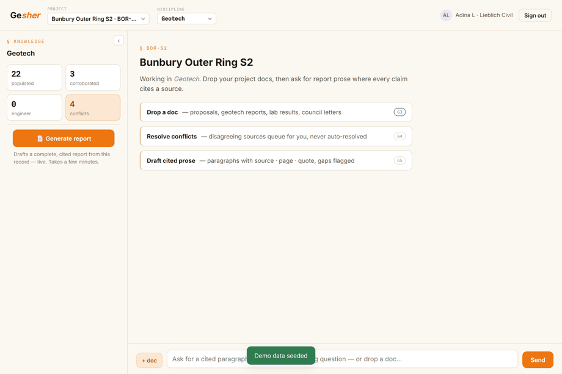
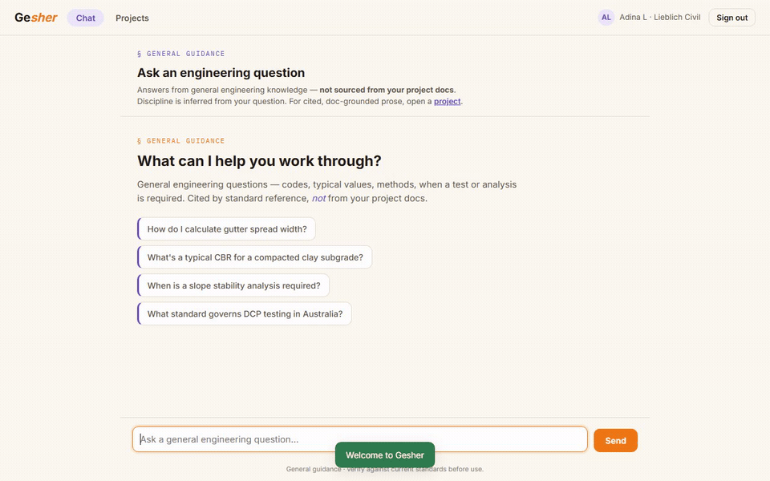
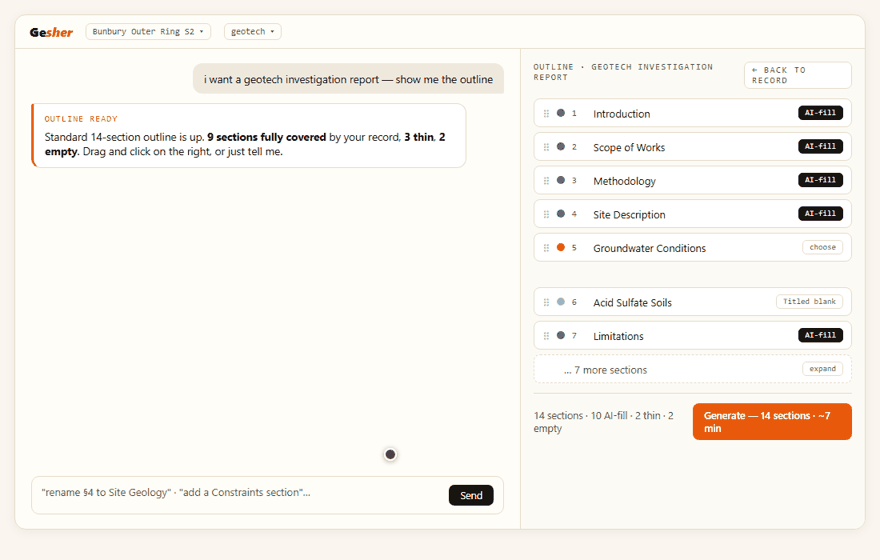
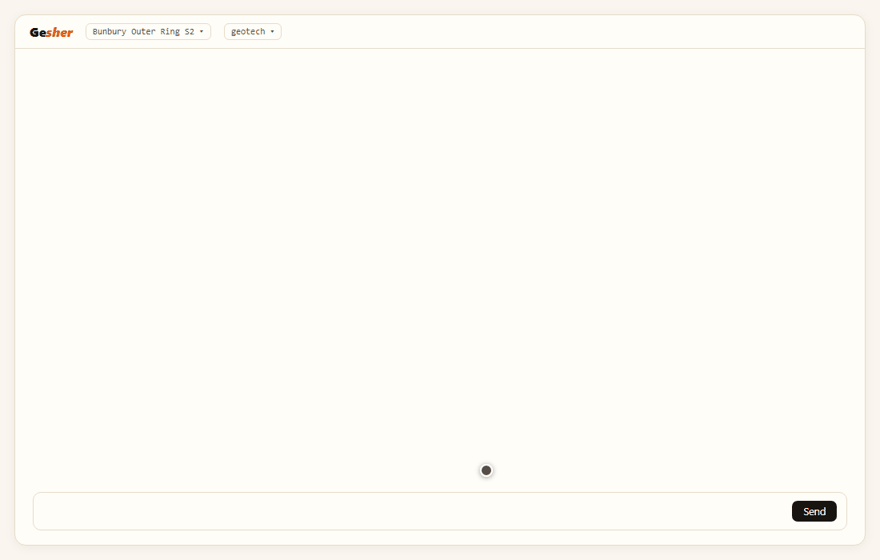
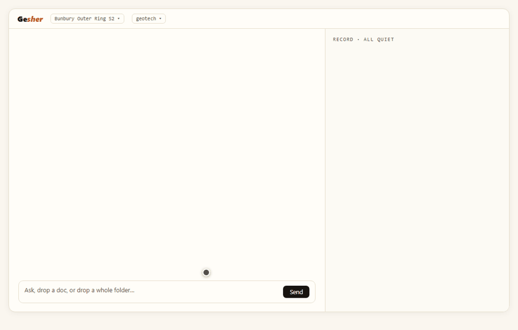

# Gesher

An AI that helps engineers write their reports without inventing facts. It reads a project's
documents, answers questions about them, and drafts cited report prose. Every fact traces back to
a source. Nothing is made up.

Built by Adina Lieblich, a civil engineer with over 13 years in the industry. Gesher is an early
working prototype. This repository is a write-up of how it works and how it was built. The product
code is private.

Interactive walkthrough, with screen recordings of the product running: https://adinalieblich.github.io/gesher/

## What it does, and what it does not do
- It drafts complete engineering reports from the engineer's own documents.
- It does not perform engineering design or analysis. The engineer does the engineering. Gesher
  writes the report.
- It does not state a fact it cannot trace to a source. If a value is not in the documents, it says so.

## Shown in the prototype

A general engineering question answered with specific Main Roads WA drawing numbers, each linked to its source document:

The report outline, derived from the documents:

A photo appendix assembled from site photos:

Revision control across report versions:

## How it works
| Note | What it covers |
|---|---|
| [Preventing hallucination](docs/01-preventing-hallucination.md) | The layers that stop the model stating an unsourced value |
| [Grounding and citations](docs/02-grounding-and-citations.md) | Every value cited to document, page and quote, and why exact text matching mismeasures it |
| [Retrieval](docs/03-rag-and-retrieval.md) | Answering from the documents, not from model memory |
| [Architecture and deployment](docs/04-architecture-and-deployment.md) | Single-tenant in the client's own cloud, with model choice as a deployment option |
| [How it was rebuilt twice](docs/05-how-it-was-rebuilt.md) | Three versions: a SaaS form workspace, then field extraction, now retrieval over the documents |

## Stack
Python, FastAPI, AWS Lambda. Full-text retrieval over the project's documents. Structured fact
extraction with source provenance. DOCX output.

## Status and limits
Early working prototype. Single-tenant is the delivery model, not yet a finished managed service.
Drafting runs on a hosted LLM today; running it in-region under zero-retention terms is the
deployment target, not a current claim. The output reduces hallucination and makes every value
checkable; a registered engineer still reviews and signs.
